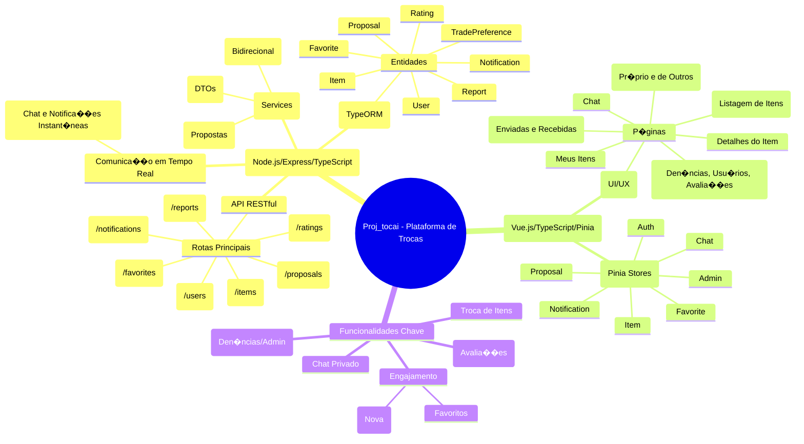

<!-- DOC-META: status=ativo; ultima_revisao=2026-04-10; proxima_revisao=trimestral -->
# Mapa Mental da Estrutura do Sistema Proj_tocai

Este mapa mental representa a estrutura de alto n�vel do sistema, suas tecnologias e as principais funcionalidades.

