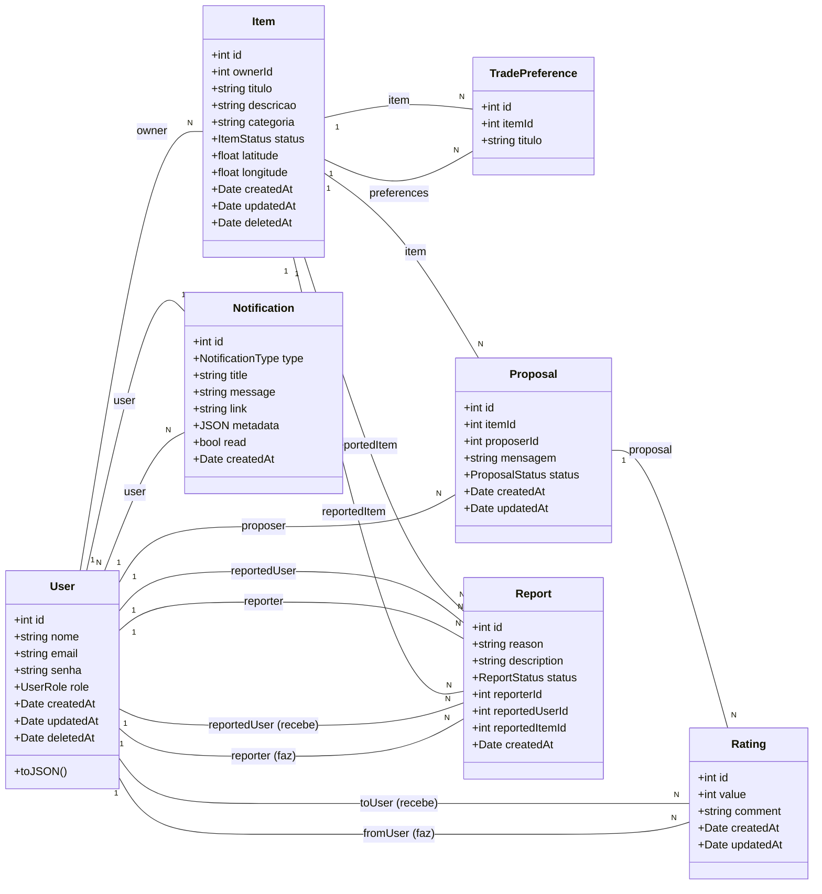

<!-- DOC-META: status=ativo; ultima_revisao=2026-04-10; proxima_revisao=trimestral -->
# Diagrama de Classes UML (Mermaid)

Este diagrama representa as principais entidades do Backend do sistema Proj_tocai e seus relacionamentos.

