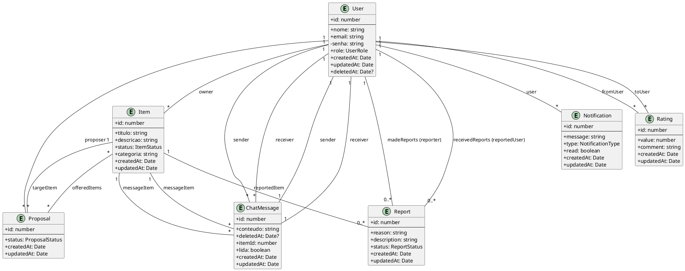

<!-- DOC-META: status=ativo; ultima_revisao=2026-04-10; proxima_revisao=trimestral -->
# ?? Manual T�cnico Completo � Projeto TrocaAi

Este documento serve como um guia detalhado para a arquitetura, estrutura e c�digo-fonte da aplica��o TrocaAi. O objetivo � fornecer uma vis�o clara de como o frontend e o backend se comunicam e como as funcionalidades s�o implementadas.

## 1. ?? Vis�o Geral

O TrocaAi � uma plataforma web completa para troca e doa��o de itens entre usu�rios. O sistema foi desenvolvido com uma arquitetura moderna, integrando um frontend reativo (Vue.js) com um backend robusto (Node.js/Express), e inclui funcionalidades em tempo real como chat, propostas e notifica��es via WebSockets.

O objetivo principal � fornecer uma experi�ncia de usu�rio fluida e segura para negocia��o de itens, com um painel administrativo para modera��o e an�lise de dados.

---

## 2. ?? Arquitetura Geral

A aplica��o segue uma arquitetura cliente-servidor desacoplada. O fluxo de dados e intera��o pode ser resumido da seguinte forma:

```
Usu�rio ? Interface Vue (Views & Components)
      |
      +--? Store (Pinia) ? Service (Axios) ? Backend API (REST)
      |
      +--? Store (Pinia) ? Service (Socket.IO) ? Backend (WebSocket)
      |
      +--? Resposta renderizada (DOM reativo)
```

**Descri��o do Fluxo:**

1.  O **Usu�rio** interage com os **Componentes Vue** (`.vue`), que comp�em a interface.
2.  As a��es do usu�rio (ex: clicar em um bot�o, preencher um formul�rio) disparam chamadas para as **Stores (Pinia)**.
3.  A **Store** centraliza o estado global e a l�gica de neg�cio do frontend. Ela decide como processar a a��o:
    *   Para opera��es de dados (buscar, criar, atualizar), a Store utiliza um **Service (Axios)** para fazer uma requisi��o HTTP � **API REST** do backend.
    *   Para comunica��o em tempo real (chat, notifica��es), a Store utiliza o **Service (Socket.IO)** para emitir ou escutar eventos do servidor **WebSocket**.
4.  O **Backend** processa a requisi��o/evento, interage com o banco de dados e retorna uma resposta (JSON para REST, ou um novo evento para WebSocket).
5.  A **Store** recebe a resposta, atualiza seu estado reativo.
6.  O **Vue**, ao detectar a mudan�a no estado da Store, re-renderiza automaticamente os componentes afetados na tela, atualizando a interface para o usu�rio.

---

## 3. ??? Estrutura do Projeto

A estrutura de pastas foi organizada para separar claramente as responsabilidades entre o frontend e o backend.

```
marklace-main/
+-- backend/
�   +-- src/
�   �   +-- config/         # Configura��es (banco de dados, JWT)
�   �   +-- controllers/    # Controladores (recebem requisi��es HTTP)
�   �   +-- entities/       # Entidades do TypeORM (mapeamento do banco)
�   �   +-- errors/         # Classes de erro customizadas
�   �   +-- middleware/     # Middlewares do Express (autentica��o, erros)
�   �   +-- routes/         # Defini��o das rotas da API
�   �   +-- scripts/        # Scripts utilit�rios (ex: resetar admin)
�   �   +-- services/       # L�gica de neg�cio principal
�   �   +-- sockets/        # L�gica para WebSockets (Socket.IO)
�   �   +-- types/          # Tipos e enums globais do backend
�   �   +-- server.ts       # Ponto de entrada da aplica��o backend
�   +-- package.json
�
+-- frontend/
�   +-- src/
�   �   +-- assets/         # Imagens, fontes e outros arquivos est�ticos
�   �   +-- components/     # Componentes Vue reutiliz�veis
�   �   +-- composables/    # Fun��es reutiliz�veis (Vue Composition API)
�   �   +-- router/         # Configura��o de rotas (Vue Router)
�   �   +-- services/       # L�gica de comunica��o com a API
�   �   +-- stores/         # Gerenciamento de estado global (Pinia)
�   �   +-- types/          # Tipos e interfaces TypeScript do frontend
�   �   +-- views/          # Componentes de p�gina (associados �s rotas)
�   �   +-- main.ts         # Ponto de entrada da aplica��o frontend
�   +-- package.json
�
+-- package.json            # Scripts para rodar ambos os projetos
```

---

## 3. Configura��o do Ambiente (`.env`)

Para rodar a aplica��o localmente, � necess�rio criar arquivos `.env` tanto no diret�rio `backend/` quanto no `frontend/`. Estes arquivos armazenam vari�veis de ambiente que n�o devem ser enviadas para o controle de vers�o (Git).

### Backend

Crie um arquivo chamado `.env` na raiz do diret�rio `backend/`.

**Exemplo (`backend/.env`):**
```env
# Porta em que o servidor backend ir� rodar
PORT=3000

# Configura��es do Banco de Dados (PostgreSQL)
DB_HOST=localhost
DB_PORT=5432
DB_USERNAME=postgres
DB_PASSWORD=sua_senha_secreta
DB_DATABASE=trocaai

# Configura��es de Autentica��o (JWT)
JWT_SECRET=seu_segredo_super_secreto_para_jwt
JWT_EXPIRES_IN=7d

# Credenciais para o script de cria��o/reset do usu�rio administrador
ADMIN_EMAIL=admin@trocaai.com
ADMIN_PASSWORD=admin123
```

### Frontend

Crie um arquivo chamado `.env` na raiz do diret�rio `frontend/`.

**Exemplo (`frontend/.env`):**
```env
# URL base da API do backend. O frontend far� as requisi��es para este endere�o.
VITE_API_URL=http://localhost:3000
```

---

## 4. Testes Automatizados

O projeto est� configurado para suportar testes automatizados tanto no backend quanto no frontend, garantindo que novas funcionalidades n�o quebrem o c�digo existente.

### Backend (Jest + Supertest)

O backend utiliza **Jest** como framework de testes e **Supertest** para realizar testes de integra��o, fazendo requisi��es HTTP reais � nossa API em um ambiente de teste.

**Como rodar os testes:**

```bash
# Navegue at� o diret�rio do backend
cd backend

# Execute o comando de teste
npm test
```

**Exemplo de Teste (`backend/src/__tests__/user.test.ts`):**

Este teste verifica se o endpoint de registro de usu�rio est� funcionando corretamente.

```typescript
// 1. Importa a biblioteca 'supertest' para simular requisi��es HTTP
import request from 'supertest'; 
// 2. Importa sua aplica��o Express para que o supertest possa se conectar a ela
import { app } from '../server'; 

// 3. 'describe' agrupa um conjunto de testes relacionados.
describe('User Endpoints', () => { 

  // 4. 'it' define um caso de teste espec�fico.
  it('should create a new user', async () => { 
    // 5. Simula uma requisi��o POST para a rota de registro com dados de um novo usu�rio.
    const res = await request(app)
      .post('/api/auth/register')
      .send({
        nome: 'Test User',
        email: `test${Date.now()}@example.com`, // Email din�mico para evitar conflitos
        senha: 'password123',
      });

    // 6. 'expect' verifica se o resultado foi o esperado.
    //    - O c�digo de status deve ser 201 (Created).
    //    - O corpo da resposta deve conter a propriedade 'user'.
    expect(res.statusCode).toEqual(201); 
    expect(res.body).toHaveProperty('user'); 
  });
});
```

### Frontend (Vitest + Vue Testing Library)

O frontend est� preparado para usar **Vitest**, um framework de testes moderno e r�pido para projetos Vite, e a **Vue Testing Library** para testar componentes Vue de uma forma que se assemelha a como o usu�rio interage com eles.

**Como rodar os testes:**

```bash
# Navegue at� o diret�rio do frontend
cd frontend

# Execute o comando de teste
npm test
```

---

## 5. C�digo-Fonte Comentado

A seguir, apresentamos os arquivos-chave do projeto com coment�rios detalhados para facilitar o estudo.

### Backend

#### `backend/src/entities/User.ts`

Este arquivo define a estrutura da tabela `users` no banco de dados. Ele usa decoradores do TypeORM para mapear propriedades da classe para colunas da tabela e definir relacionamentos.

```typescript
import {
  Entity,
  PrimaryGeneratedColumn,
  Column,
  CreateDateColumn,
  UpdateDateColumn,
  OneToMany,
  DeleteDateColumn
} from 'typeorm';
import { Notification } from './Notification';
import { Rating } from './Rating';
import { ChatMessage } from './ChatMessage';
import { Item } from './Item';
import { Proposal } from './Proposal';
import { Report } from './Report';
import { UserRole } from '../types';

/**
 * @Entity 'users'
 * Define a classe User como uma entidade do TypeORM, que ser� mapeada para uma tabela chamada 'users'.
 */
@Entity('users')
export class User {
  // Chave prim�ria auto-incrementada.
  @PrimaryGeneratedColumn()
  id: number;

  // Coluna para o nome do usu�rio.
  @Column({ type: 'varchar', length: 100 })
  nome: string;

  // Coluna para o email, que deve ser �nico.
  @Column({ type: 'varchar', length: 100, unique: true })
  email: string;

  // Coluna para a senha, que armazenar� o hash.
  @Column({ type: 'varchar', length: 255 })
  senha: string;

  // Coluna para o papel (role) do usu�rio, com um valor padr�o 'common'.
  @Column({
    type: 'varchar',
    length: 20,
    default: UserRole.COMMON
  })
  role: UserRole;

  // --- RELACIONAMENTOS ---
  // Os relacionamentos abaixo n�o usam onDelete: 'CASCADE' no n�vel do banco de dados,
  // pois a exclus�o de um usu�rio � gerenciada manualmente no UserService.delete()
  // dentro de uma transa��o para garantir a integridade e ordem da exclus�o.
  // Para User e ChatMessage, � utilizado o "soft delete" (exclus�o l�gica).

  // Um usu�rio pode ter muitos itens.
  @OneToMany(() => Item, (item) => item.owner)
  items: Item[];

  // Um usu�rio pode fazer muitas propostas.
  @OneToMany(() => Proposal, (proposal) => proposal.proposer)
  proposals: Proposal[];

  // Um usu�rio pode ter muitas notifica��es.
  @OneToMany(() => Notification, (notification) => notification.user)
  notifications: Notification[];

  // Um usu�rio pode receber muitas avalia��es.
  @OneToMany(() => Rating, (rating) => rating.toUser)
  receivedRatings: Rating[];

  // Um usu�rio pode dar muitas avalia��es.
  @OneToMany(() => Rating, (rating) => rating.fromUser)
  givenRatings: Rating[];

  // Um usu�rio pode enviar muitas mensagens de chat.
  @OneToMany(() => ChatMessage, (message) => message.sender)
  sentMessages: ChatMessage[];

  // Um usu�rio pode receber muitas mensagens de chat.
  @OneToMany(() => ChatMessage, (message) => message.receiver)
  receivedMessages: ChatMessage[];

  // Um usu�rio pode fazer v�rias den�ncias.
  @OneToMany(() => Report, (report) => report.reporter)
  madeReports: Report[];

  // Um usu�rio pode receber v�rias den�ncias.
  @OneToMany(() => Report, (report) => report.reportedUser)
  receivedReports: Report[];

  // --- TIMESTAMPS ---

  // Data de cria��o do registro, preenchida automaticamente.
  @CreateDateColumn()
  createdAt: Date;

  // Data da �ltima atualiza��o, preenchida automaticamente.
  @UpdateDateColumn()
  updatedAt: Date;

  // Data da exclus�o (soft delete), se configurado.
  @DeleteDateColumn()
  deletedAt?: Date;

  /**
   * M�todo para serializar o objeto User para JSON.
   * � crucial para remover dados sens�veis, como a senha, antes de enviar
   * o objeto do usu�rio para o frontend.
   */
  toJSON() {
    // Usa desestrutura��o para criar um novo objeto sem a propriedade 'senha'.
    const { senha, ...userWithoutPassword } = this;
    return userWithoutPassword;
  }
}
```

#### `backend/src/services/user.service.ts`

Este servi�o cont�m toda a l�gica de neg�cio relacionada aos usu�rios, como registro, login, atualiza��o e exclus�o. Ele interage diretamente com o banco de dados atrav�s dos reposit�rios do TypeORM.

#### Mapa de M�todos do `UserService`

| M�todo | Par�metros | Retorno | Descri��o |
| :--- | :--- | :--- | :--- |
| `register` | `nome`, `email`, `senha` | `Promise<{ user, token }>` | Registra um novo usu�rio, criptografa a senha e gera um token JWT. |
| `login` | `email`, `senha` | `Promise<{ user, token }>` | Autentica um usu�rio existente e gera um novo token JWT. |
| `findById` | `id` | `Promise<User>` | Busca um usu�rio pelo seu ID, retornando seus dados p�blicos. |
| `delete` | `id` | `Promise<void>` | Deleta um usu�rio e todos os seus dados associados usando uma transa��o segura. |

---

```typescript
// backend/src/services/user.service.ts
import { AppDataSource } from '../config/database';
import { In, IsNull } from 'typeorm';
import { User } from '../entities/User';
import { Item } from '../entities/Item';
import bcrypt from 'bcryptjs'; // Biblioteca para criptografar senhas
import { Proposal } from '../entities/Proposal';
import { Notification } from '../entities/Notification';
import { Rating } from '../entities/Rating';
import { ChatMessage } from '../entities/ChatMessage';
import { Report } from '../entities/Report';

import jwt, { SignOptions } from 'jsonwebtoken'; // Biblioteca para gerar tokens JWT
import { UserRole } from '../types';
import { getJWTSecret, JWT_CONFIG } from '../config/jwt';
import { BadRequestError, NotFoundError, ForbiddenError } from '../errors/http-errors';

export class UserService {
  // Inicializa os reposit�rios para cada entidade que o servi�o ir� manipular.
  // O reposit�rio � a interface para realizar opera��es CRUD no banco de dados.
  private userRepository = AppDataSource.getRepository(User);
  private itemRepository = AppDataSource.getRepository(Item);
  private proposalRepository = AppDataSource.getRepository(Proposal);
  private notificationRepository = AppDataSource.getRepository(Notification);
  private ratingRepository = AppDataSource.getRepository(Rating);
  private chatMessageRepository = AppDataSource.getRepository(ChatMessage);
  private reportRepository = AppDataSource.getRepository(Report);

  /**
   * Registra um novo usu�rio no sistema.
   * @param nome - Nome do usu�rio.
   * @param email - Email do usu�rio (deve ser �nico).
   * @param senha - Senha em texto plano.
   * @returns Um objeto contendo os dados do usu�rio (sem a senha) e um token JWT.
   */
  async register(nome: string, email: string, senha: string) {
    // 1. Verifica se o email j� est� em uso por um usu�rio ATIVO.
    // A condi��o `deletedAt: IsNull()` garante que um novo usu�rio possa se registrar
    // com um email que pertencia a uma conta deletada.
    // ATEN��O: Isso requer um �ndice �nico parcial no banco de dados para funcionar corretamente.
    // Ex: CREATE UNIQUE INDEX "UQ_email_not_deleted" ON "users" (email) WHERE "deletedAt" IS NULL;
    const existingUser = await this.userRepository.findOne({ where: { email, deletedAt: IsNull() } });
    if (existingUser) {
      throw new BadRequestError('Email j� cadastrado');
    }

    // 2. Criptografa a senha antes de salvar no banco. O '10' � o "salt rounds".
    const hashedPassword = await bcrypt.hash(senha, 10);

    // 3. Cria uma nova inst�ncia de User.
    const user = this.userRepository.create({
      nome,
      email,
      senha: hashedPassword,
      role: UserRole.COMMON // Todo novo usu�rio come�a como 'common'.
    });

    // 4. Salva o usu�rio no banco de dados.
    await this.userRepository.save(user);

    // 5. Gera um token JWT para o novo usu�rio ser autenticado imediatamente.
    const jwtOptions: SignOptions = { expiresIn: JWT_CONFIG.expiresIn };
    const token = jwt.sign(
      { userId: user.id, role: user.role }, // Payload do token
      getJWTSecret(), // Chave secreta para assinar o token
      jwtOptions
    );

    // 6. Retorna os dados do usu�rio e o token.
    return {
      user: user.toJSON(), // Usa o m�todo toJSON() para remover a senha.
      token
    };
  }

  /**
   * Autentica um usu�rio existente.
   * @param email - Email do usu�rio.
   * @param senha - Senha em texto plano.
   * @returns Um objeto contendo os dados do usu�rio e um novo token JWT.
   */
  async login(email: string, senha: string) {
    // 1. Busca o usu�rio pelo email, garantindo que ele n�o tenha sido deletado.
    // Um usu�rio com `deletedAt` preenchido n�o pode mais fazer login.
    const user = await this.userRepository.findOne({ where: { email, deletedAt: IsNull() } });
    if (!user) {
      throw new ForbiddenError('Credenciais inv�lidas'); // Mensagem gen�rica por seguran�a.
    }

    // 2. Compara a senha fornecida com o hash salvo no banco.
    const isValidPassword = await bcrypt.compare(senha, user.senha);
    if (!isValidPassword) {
      throw new ForbiddenError('Credenciais inv�lidas'); // Mesma mensagem gen�rica.
    }

    // 3. Gera um novo token JWT.
    const jwtOptions: SignOptions = { expiresIn: JWT_CONFIG.expiresIn };
    const token = jwt.sign(
      { userId: user.id, role: user.role },
      getJWTSecret(),
      jwtOptions
    );

    // 4. Retorna os dados do usu�rio e o token.
    return {
      user: user.toJSON(),
      token
    };
  }

  /**
   * Busca um usu�rio pelo seu ID.
   * @param id - O ID do usu�rio.
   * @returns Os dados p�blicos do usu�rio.
   */
  async findById(id: number) {
    // Busca o usu�rio pelo ID, garantindo que ele n�o tenha sido deletado.
    const user = await this.userRepository.findOne({ where: { id, deletedAt: IsNull() } });
    if (!user) {
      throw new NotFoundError('Usu�rio n�o encontrado');
    }
    return user.toJSON();
  }

  /**
   * Deleta um usu�rio e todos os seus dados associados de forma segura.
   * Utiliza uma transa��o para garantir a atomicidade da opera��o: ou tudo � deletado, ou nada �.
   * @param id - O ID do usu�rio a ser deletado.
   */
  async delete(id: number): Promise<void> {
    // Logging para facilitar a depura��o.
    console.log('\n+----------------------------------------------------+');
    console.log('�  ???  INICIANDO PROCESSO DE EXCLUS�O DE USU�RIO   �');
    console.log('+----------------------------------------------------+\n');
    console.log(`?? ID do usu�rio: ${id}\n`);

    // O QueryRunner permite controlar transa��es manualmente.
    const queryRunner = AppDataSource.createQueryRunner();
    await queryRunner.connect();
    await queryRunner.startTransaction();

    try {
      // PASSO 1: Verificar se o usu�rio existe dentro da transa��o.
      const user = await queryRunner.manager.findOne(User, { where: { id, deletedAt: IsNull() } });
      if (!user) {
        throw new NotFoundError('Usu�rio n�o encontrado');
      }
      
      // A ordem de exclus�o � importante para respeitar as chaves estrangeiras.
      // Deleta-se primeiro as entidades que dependem do usu�rio.

      // PASSO 2: Deletar den�ncias (Reports)
      await queryRunner.manager.delete(Report, { reporter: { id } });
      await queryRunner.manager.delete(Report, { reportedUser: { id } });

      // PASSO 3: Deletar mensagens de chat (ChatMessage)
      // Para ChatMessage, aplicamos o "soft delete" para preservar o hist�rico,
      // mas marcando as mensagens como deletadas para o usu�rio em quest�o.
      await queryRunner.manager.softDelete(ChatMessage, { sender: { id } });
      await queryRunner.manager.softDelete(ChatMessage, { receiver: { id } });

      // PASSO 4: Deletar avalia��es (Rating)
      // Nota: O nome da rela��o no Rating.ts � 'fromUser' e 'toUser'.
      await queryRunner.manager.delete(Rating, { fromUser: { id } });
      await queryRunner.manager.delete(Rating, { toUser: { id } });

      // PASSO 5: Deletar notifica��es (Notification)
      await queryRunner.manager.delete(Notification, { user: { id } });

      // PASSO 6: Deletar propostas (Proposal)
      // Deleta propostas que o usu�rio fez.
      await queryRunner.manager.delete(Proposal, { proposer: { id } });
      
      // Deleta propostas que o usu�rio recebeu (nos itens dele).
      const userItems = await queryRunner.manager.find(Item, { 
        where: { owner: { id } },
        select: ['id'] // Seleciona apenas os IDs para otimiza��o.
      });
      
      if (userItems.length > 0) {
        const itemIds = userItems.map(item => item.id);
        // Deleta todas as propostas onde o 'item.id' est� na lista de IDs dos itens do usu�rio.
        await queryRunner.manager.delete(Proposal, { item: { id: In(itemIds) } });
      }

      // PASSO 7: Deletar itens (Item)
      await queryRunner.manager.delete(Item, { owner: { id } });

      // PASSO 8: Finalmente, deletar o pr�prio usu�rio.
      // Para o usu�rio, aplicamos o "soft delete" usando o m�todo do TypeORM.
      await queryRunner.manager.softDelete(User, { id });

      // Se todos os passos acima foram bem-sucedidos, confirma a transa��o.
      await queryRunner.commitTransaction();

      console.log('? USU�RIO DELETADO COM SUCESSO!');

    } catch (error) {
      // Se qualquer passo falhar, desfaz todas as opera��es da transa��o.
      await queryRunner.rollbackTransaction();
      console.error('? ERRO AO DELETAR USU�RIO. ROLLBACK REALIZADO.', error);
      throw error; // Propaga o erro para o controlador.
      
    } finally {
      // Libera o queryRunner para que a conex�o possa ser reutilizada.
      await queryRunner.release();
    }
  }

  // ... outros m�todos como update, findAll, etc.
}
```

#### `backend/src/services/admin.service.ts`

Este servi�o agrega dados de v�rias partes do sistema para fornecer estat�sticas e informa��es para o painel de administra��o.

#### Mapa de M�todos do `AdminService`

| M�todo | Par�metros | Retorno | Descri��o |
| :--- | :--- | :--- | :--- |
| `getDashboardStats` | Nenhum | `Promise<Object>` | Coleta v�rias estat�sticas (usu�rios, itens, propostas, etc.) para o dashboard. |
| `getRecentActivity` | Nenhum | `Promise<Array<Object>>` | Busca as atividades mais recentes da plataforma, como novas propostas e trocas conclu�das. |

---

```typescript
import { AppDataSource } from '../config/database';
import { User } from '../entities/User';
import { Item } from '../entities/Item';
import { Proposal } from '../entities/Proposal';
import { ChatMessage } from '../entities/ChatMessage';
import { Notification, NotificationType } from '../entities/Notification';
import { ItemStatus, ProposalStatus } from '../types';
import { In, MoreThanOrEqual } from 'typeorm';

export class AdminService {
  // Reposit�rios para acessar as tabelas.
  private userRepository = AppDataSource.getRepository(User);
  private itemRepository = AppDataSource.getRepository(Item);
  private proposalRepository = AppDataSource.getRepository(Proposal);
  private messageRepository = AppDataSource.getRepository(ChatMessage);
  private notificationRepository = AppDataSource.getRepository(Notification);

  /**
   * Coleta v�rias estat�sticas para o dashboard do administrador.
   * @returns Um objeto com diversas contagens e m�tricas.
   */
  async getDashboardStats() {
    const now = new Date();
    const startOfMonth = new Date(now.getFullYear(), now.getMonth(), 1); // In�cio do m�s atual
    const today = new Date(now.getFullYear(), now.getMonth(), now.getDate()); // In�cio do dia atual
    const startOfWeek = new Date(now); // Cria uma nova inst�ncia para evitar modificar 'now'
    startOfWeek.setDate(now.getDate() - now.getDay()); // Define para o in�cio da semana

    // Otimiza��o: Usa Promise.all para executar todas as consultas ao banco de dados
    // em paralelo, em vez de uma ap�s a outra (em s�rie). Isso reduz drasticamente o tempo de resposta.
    const [
      totalUsers,
      newUsersThisMonth,
      totalItems,
      itemsThisMonth,
      itemsDisponiveis,
      itemsTrocados,
      totalProposals,
      acceptedProposals,
      totalMessages,
      messagesToday,
      activeUsers,
    ] = await Promise.all([
      // Estat�sticas de Usu�rios
      this.userRepository.count({ where: { deletedAt: IsNull() } }),
      this.userRepository.count({ where: { createdAt: MoreThanOrEqual(startOfMonth), deletedAt: IsNull() } }),
      // Estat�sticas de Itens
      this.itemRepository.count(),
      this.itemRepository.count({ where: { createdAt: MoreThanOrEqual(startOfMonth) } }),
      this.itemRepository.count({ where: { status: ItemStatus.DISPONIVEL } }),
      this.itemRepository.count({ where: { status: ItemStatus.TROCADO } }),
      // Estat�sticas de Propostas
      this.proposalRepository.count(),
      this.proposalRepository.count({ where: { status: ProposalStatus.ACEITA } }),
      // Estat�sticas de Mensagens
      this.messageRepository.count({ where: { deletedAt: IsNull() } }),
      this.messageRepository.count({ where: { createdAt: MoreThanOrEqual(today), deletedAt: IsNull() } }),
      // Contagem de usu�rios ativos (que tiveram alguma atividade na �ltima semana)
      this.userRepository.createQueryBuilder("user")
        .where("user.updatedAt >= :date AND user.deletedAt IS NULL", { date: startOfWeek })
        .getCount(),
    ]);

    // C�lculos feitos ap�s as consultas retornarem.
    const acceptanceRate = totalProposals > 0 ? (acceptedProposals / totalProposals) * 100 : 0;
    const daysSinceStart = Math.ceil((new Date().getTime() - new Date(2023, 0, 1).getTime()) / (1000 * 60 * 60 * 24));
    const averageMessagesPerDay = totalMessages > 0 && daysSinceStart > 0 ? totalMessages / daysSinceStart : 0;

    // Retorna o objeto formatado para o frontend.
    return {
      totalUsers,
      newUsersThisMonth,
      activeUsers,
      totalItems,
      itemsThisMonth,
      itemsDisponiveis,
      itemsTrocados,
      totalProposals,
      acceptanceRate: parseFloat(acceptanceRate.toFixed(1)),
      totalMessages,
      messagesToday,
      averageMessagesPerDay: parseFloat(averageMessagesPerDay.toFixed(1)),
    };
  }

  /**
   * Busca as atividades recentes na plataforma com base nas notifica��es.
   * @returns Uma lista formatada de atividades recentes.
   */
  async getRecentActivity() {
    // Define quais tipos de notifica��o s�o considerados "atividades" relevantes.
    const activityTypes = [
      NotificationType.NEW_PROPOSAL,
      NotificationType.PROPOSAL_ACCEPTED,
    ];

    // Busca as 5 notifica��es mais recentes dos tipos definidos.
    const recentNotifications = await this.notificationRepository.find({
      where: { type: In(activityTypes) },
      order: { createdAt: 'DESC' },
      take: 5,
      relations: ['user'], // 'relations' faz um JOIN com a tabela de usu�rios para j� trazer os dados do usu�rio.
    });

    // Mapeia os dados brutos do banco para um formato mais amig�vel para o frontend.
    return recentNotifications.map(notif => {
      let icon = '??';
      let action = notif.message;
      let user = notif.user ? notif.user.nome : 'Usu�rio';

      // Customiza o �cone e a mensagem com base no tipo de notifica��o.
      if (notif.type === NotificationType.NEW_PROPOSAL) {
        icon = '??';
        action = `fez uma proposta para um item.`;
      } else if (notif.type === NotificationType.PROPOSAL_ACCEPTED) {
        icon = '??';
        action = `concluiu uma troca.`;
      }

      return {
        user: user,
        action: action,
        time: this.formatTimeAgo(notif.createdAt),
        icon: icon,
      };
    });
  }

  // ... outros m�todos como getTopCategories, getGrowthData, etc.

  /**
   * Formata uma data para uma string de "tempo atr�s" (ex: "5 min atr�s").
   * @param date - A data a ser formatada.
   * @returns A string formatada.
   */
  private formatTimeAgo(date: Date): string {
    const seconds = Math.floor((new Date().getTime() - date.getTime()) / 1000);
    if (seconds < 60) return `${seconds} seg atr�s`;
    const minutes = Math.floor(seconds / 60);
    if (minutes < 60) return `${minutes} min atr�s`;
    const hours = Math.floor(minutes / 60);
    if (hours < 24) return `${hours} horas atr�s`;
    const days = Math.floor(hours / 24);
    return days === 1 ? `1 dia atr�s` : `${days} dias atr�s`;
  }
}
```

### Frontend

#### `frontend/src/stores/chat.ts`

Esta � a store Pinia para o chat. Ela centraliza todo o estado e a l�gica relacionados ao chat: conex�o com WebSocket, lista de conversas, mensagens, envio, recebimento, etc. Usar uma store garante que o estado do chat seja consistente em toda a aplica��o.

```typescript
import { defineStore } from 'pinia';
import { ref, computed } from 'vue';
import { io, Socket } from 'socket.io-client';
import api from '@/services/api';
import { useAuthStore } from './auth';
import type { Conversation, ChatMessage, User, Item } from '@/types';

/**
 * defineStore('chat', () => { ... })
 * Cria uma nova store Pinia com o ID 'chat'.
 * A fun��o setup (arrow function) define o estado, getters e a��es.
 */
export const useChatStore = defineStore('chat', () => {
  // --- DEPEND�NCIAS ---
  // A store de chat depende da store de autentica��o para saber se o usu�rio est� logado.
  const authStore = useAuthStore();

  // --- ESTADO (State) ---
  // 'ref()' cria um estado reativo, similar ao 'data()' em Options API.
  const socket = ref<Socket | null>(null); // A inst�ncia do cliente Socket.IO.
  const conversations = ref<Conversation[]>([]); // Lista de todas as conversas do usu�rio.
  const currentMessages = ref<ChatMessage[]>([]); // Mensagens da conversa atualmente selecionada.
  const loading = ref(false); // Para indicar carregamento de dados (ex: buscar mensagens).
  const onlineUsers = ref<Set<number>>(new Set()); // Um Set com os IDs dos usu�rios online.
  const typingUsers = ref<Set<number>>(new Set()); // Um Set com os IDs dos usu�rios que est�o digitando.

  // Estado para controlar a interface do chat.
  const isChatOpen = ref(false); // Se a janela do chat est� aberta ou fechada.
  const selectedConversation = ref<Conversation | null>(null); // A conversa que est� sendo visualizada.
  const conversationToOpen = ref<{ otherUserId: number; itemId: number } | null>(null); // Sinal para abrir uma conversa espec�fica.

  // --- GETTERS (Computed Properties) ---
  // 'computed()' cria um valor derivado do estado que � cacheado e reativo.
  const connected = computed(() => socket.value?.connected ?? false);
  const unreadCount = computed(() => 
    conversations.value.reduce((sum, conv) => sum + conv.unreadCount, 0)
  );

  // --- A��ES (Actions) ---
  // Fun��es que podem ser chamadas para modificar o estado.

  /**
   * Inicia a conex�o com o servidor WebSocket.
   */
  const connect = () => {
    // N�o tenta conectar se j� estiver conectado ou se o usu�rio n�o estiver logado.
    if (socket.value?.connected || !authStore.isAuthenticated) return;
    const token = localStorage.getItem('token');
    if (!token) return;

    // Cria a inst�ncia do socket, passando o token JWT para autentica��o no backend.
    socket.value = io(import.meta.env.VITE_API_URL || 'http://localhost:3000', { 
      auth: { token },
      transports: ['websocket', 'polling'] // Estrat�gias de conex�o.
    });
    
    // Configura os listeners para os eventos do servidor.
    setupSocketListeners();
  };

  /**
   * Configura todos os listeners de eventos do Socket.IO.
   * Centralizar isso em uma fun��o mant�m o c�digo organizado.
   */
  const setupSocketListeners = () => {
    if (!socket.value) return;

    // Evento: 'connect' - disparado quando a conex�o � bem-sucedida.
    socket.value.on('connect', () => {
      console.log('? WebSocket conectado');
      socket.value?.emit('user:request_online_list'); // Pede a lista de usu�rios online.
    });

    // Evento: 'message:received' - disparado quando uma nova mensagem chega.
    socket.value.on('message:received', (message: ChatMessage) => {
      // L�gica para atualizar a lista de conversas e as mensagens da conversa aberta.
      // ...
      // Se a conversa estiver aberta, adiciona a mensagem � lista `currentMessages`.
      if (selectedConversation.value && (message.senderId === selectedConversation.value.otherUser.id)) {
        currentMessages.value.push(message);
        markAsRead(message.senderId); // Marca como lida automaticamente.
      }
    });

    // Evento: 'user:online' / 'user:offline' - para atualizar a lista de usu�rios online.
    socket.value.on('user:online', (userId: number) => onlineUsers.value.add(userId));
    socket.value.on('user:offline', (userId: number) => onlineUsers.value.delete(userId));
    
    // Evento: 'user:typing' - para mostrar o indicador "est� digitando...".
    socket.value.on('user:typing', (data: { senderId: number; isTyping: boolean }) => {
      if (data.isTyping) {
        typingUsers.value.add(data.senderId);
      } else {
        typingUsers.value.delete(data.senderId);
      }
    });
  };

  /**
   * Envia uma mensagem para o servidor.
   * @param otherUserId - ID do destinat�rio.
   * @param itemId - ID do item relacionado � conversa.
   * @param content - Conte�do da mensagem.
   */
  const sendMessage = async (otherUserId: number, itemId: number, content: string) => {
    if (!socket.value?.connected || !content.trim() || !authStore.user) return;

    // ATUALIZA��O OTIMISTA: Adiciona a mensagem na UI imediatamente, antes mesmo
    // de receber a confirma��o do servidor. Isso torna a UI mais r�pida.
    const tempMessage: ChatMessage = {
      id: Date.now(), // ID tempor�rio.
      content: content.trim(),
      senderId: authStore.user.id,
      receiverId: otherUserId,
      itemId,
      read: false,
      createdAt: new Date().toISOString()
    };
    currentMessages.value.push(tempMessage);
    
    // Emite o evento para o servidor.
    socket.value.emit('message:send', {
      receiverId: otherUserId,
      itemId,
      content: content.trim()
    });
  };

  /**
   * Reseta completamente o estado da store. Essencial para o processo de logout.
   */
  const resetStore = () => {
    disconnect(); // Desconecta o socket.
    conversations.value = [];
    loading.value = false;
    isChatOpen.value = false;
    selectedConversation.value = null;
    conversationToOpen.value = null;
    currentMessages.value = [];
  };

  // O retorno da fun��o setup exp�e os estados, getters e a��es para serem usados nos componentes.
  return {
    // Estados
    socket,
    conversations,
    currentMessages,
    loading,
    isChatOpen,
    selectedConversation,
    // Computed
    connected,
    unreadCount,
    // A��es
    connect,
    sendMessage,
    resetStore,
    // ...outras a��es
  };
});
```

#### `frontend/src/components/AppHeader.vue`

Este � o componente do cabe�alho principal da aplica��o. Ele � respons�vel pela navega��o, exibi��o do status de login do usu�rio e acionadores para os menus de perfil e mobile.

```vue
<script setup lang="ts">
import { ref, computed, onMounted, watch, Teleport } from 'vue';
import { useRouter } from 'vue-router';
import { useAuthStore } from '@/stores/auth';
import { useChatStore } from '@/stores/chat';
import { useNotificationStore } from '@/stores/notification';
import { useToast } from '@/composables/useToast';
import NotificationDropdown from './NotificationDropdown.vue';

// --- HOOKS e STORES ---
const router = useRouter();
const authStore = useAuthStore();
const chatStore = useChatStore();
const notificationStore = useNotificationStore();
const toast = useToast();

// --- ESTADO REATIVO LOCAL ---
const isProfileMenuOpen = ref(false); // Controla o menu dropdown do perfil.
const isLoggingOut = ref(false); // Controla o estado de "carregando" do bot�o de logout.
const isMobileMenuOpen = ref(false); // Controla a visibilidade do menu lateral em telas pequenas.

// --- LIFECYCLE HOOKS ---
onMounted(() => {
  // Quando o componente � montado, se o usu�rio estiver autenticado,
  // busca as notifica��es e conecta ao chat.
  if (authStore.isAuthenticated) {
    notificationStore.fetchNotifications();
    chatStore.connect();
  }
});

// --- WATCHERS (Observadores) ---

// Observa a rota atual. Se a rota mudar, fecha ambos os menus.
// Isso melhora a experi�ncia de navega��o no mobile.
watch(() => router.currentRoute.value, () => {
  isProfileMenuOpen.value = false;
  isMobileMenuOpen.value = false;
});

// Observa o estado do menu m�vel para travar a rolagem da p�gina (body)
// quando o menu estiver aberto, evitando scroll indesejado do conte�do de fundo.
watch(isMobileMenuOpen, (isOpen) => {
  document.body.style.overflow = isOpen ? 'hidden' : '';
});

// --- M�TODOS ---

/**
 * Lida com o processo de logout do usu�rio.
 */
const handleLogout = async () => {
  if (isLoggingOut.value) return; // Evita cliques m�ltiplos.
  isLoggingOut.value = true;
  try {
    // 1. Reseta as stores de chat e notifica��es.
    chatStore.resetStore();
    notificationStore.clearAll?.();
    
    // 2. Chama a a��o de logout da store de autentica��o.
    authStore.logout();

    // 3. Redireciona para a p�gina de login.
    await router.push('/login');
    toast.success('Voc� saiu com sucesso!');
  } catch (error) {
    console.error('Erro ao fazer logout:', error);
    toast.error('Erro ao sair');
  } finally {
    isLoggingOut.value = false; // Reseta o estado de carregamento.
  }
};
</script>

<template>
  <header class="bg-white/80 backdrop-blur-sm shadow-sm sticky top-0 z-50">
    <div class="container mx-auto px-4">
      <div class="flex items-center justify-between h-16">
        <!-- Logo e links de navega��o principais -->
        <RouterLink to="/" class="flex items-center space-x-3 group">
          <!-- ... -->
        </RouterLink>

        <!-- Menu de navega��o para Desktop -->
        <nav class="hidden lg:flex items-center space-x-2">
          <!-- ... -->
        </nav>

        <!-- A��es do lado direito (login, perfil, etc.) -->
        <div class="flex items-center space-x-2">
          <!-- Se o usu�rio estiver autenticado -->
          <template v-if="authStore.isAuthenticated">
            <!-- Dropdown de Notifica��es -->
            <NotificationDropdown />

            <!-- Menu do Perfil (Avatar) -->
            <div 
              class="relative"
              @mouseenter="isProfileMenuOpen = true"
              @mouseleave="isProfileMenuOpen = false"
            >
              <!-- ... (bot�o do avatar) ... -->
              <transition name="fade">
                <div v-if="isProfileMenuOpen" class="absolute right-0 ...">
                  <!-- ... (links do perfil) ... -->
                  <button 
                    @click="handleLogout" 
                    :disabled="isLoggingOut"
                    class="..."
                  >
                    <span v-if="!isLoggingOut">Sair</span>
                    <span v-else>Saindo...</span>
                  </button>
                </div>
              </transition>
            </div>
          </template>

          <!-- Se o usu�rio N�O estiver autenticado -->
          <template v-else>
            <RouterLink to="/login">Entrar</RouterLink> 
            <RouterLink to="/register">Cadastrar</RouterLink>
          </template>

          <!-- Bot�o para abrir o menu m�vel (vis�vel apenas em telas pequenas) -->
          <button @click="isMobileMenuOpen = true" class="lg:hidden">
            <!-- ... (�cone de menu) ... -->
          </button>
        </div>
      </div>
    </div>

    <!-- 
      MENU M�VEL com <Teleport>
      <Teleport to="body"> renderiza seu conte�do em um local diferente do DOM,
      neste caso, diretamente no `<body>`. Isso � �til para modais, pop-ups e menus
      laterais, pois evita problemas de `z-index` e `overflow` com os elementos pais.
    -->
    <Teleport to="body">
      <transition name="fade">
        <!-- Overlay escuro de fundo -->
        <div
          v-if="isMobileMenuOpen"
          class="fixed inset-0 z-[999] ..."
          @click="isMobileMenuOpen = false"
        >
          <!-- Painel do menu lateral -->
          <transition name="slide">
            <div
              v-if="isMobileMenuOpen"
              @click.stop <!-- Evita que o clique no painel feche o menu (propaga��o) -->
              class="relative w-72 ..."
            >
              <!-- ... (conte�do e links do menu m�vel) ... -->
            </div>
          </transition>
        </div>
      </transition>
    </Teleport>
  </header>
</template>

<style lang="postcss" scoped>
/* ... (estilos de transi��o e para o link ativo) ... */

/* 
  A classe `.router-link-exact-active` � adicionada automaticamente pelo Vue Router
  ao link que corresponde exatamente � rota atual. Usamos isso para destacar
  o item de menu ativo. O `!bg-primary-50` � uma sintaxe do Tailwind para
  for�ar a aplica��o desta cor de fundo (`!important`).
*/
.router-link-exact-active {
  @apply bg-primary-50 !bg-primary-50 text-primary-700 font-semibold;
}
</style>
```

---

## 6. Mapa de Rotas da API (Endpoints)

Esta se��o fornece uma refer�ncia completa de todos os endpoints da API RESTful do backend.

### Autentica��o (`/api/auth`)

| M�todo | Endpoint | Descri��o | Autentica��o | DTO/Payload |
| :--- | :--- | :--- | :--- | :--- |
| `POST` | `/register` | Registra um novo usu�rio. | P�blica | `RegisterUserDto` |
| `POST` | `/login` | Autentica um usu�rio e retorna um token JWT. | P�blica | `LoginUserDto` |
| `GET` | `/me` | Retorna os dados do usu�rio autenticado. | Requerida | N/A |

### Usu�rios (`/api/users`)

| M�todo | Endpoint | Descri��o | Autentica��o | DTO/Payload |
| :--- | :--- | :--- | :--- | :--- |
| `GET` | `/` | Lista todos os usu�rios. | Admin | N/A |
| `GET` | `/:id` | Busca um usu�rio espec�fico por ID. | Requerida | N/A |
| `PUT` | `/:id` | Atualiza os dados de um usu�rio. | Requerida (pr�prio usu�rio) ou Admin | `UpdateUserDTO` |
| `DELETE` | `/:id` | Deleta um usu�rio. | Admin | N/A |
| `PATCH` | `/:id/role` | Altera o papel (role) de um usu�rio. | Admin | `UpdateUserRoleDTO` |
| `PATCH` | `/:id/restore` | Restaura um usu�rio soft-deletado. | Admin | N/A |

### Itens (`/api/items`)

| M�todo | Endpoint | Descri��o | Autentica��o | DTO/Payload |
| :--- | :--- | :--- | :--- | :--- |
| `GET` | `/` | Lista todos os itens com filtros (pagina��o, categoria, busca). | P�blica | N/A (Query Params) |
| `GET` | `/categories` | Retorna uma lista de todas as categorias de itens existentes. | P�blica | N/A |
| `GET` | `/my` | Lista todos os itens pertencentes ao usu�rio autenticado. | Requerida | N/A |
| `GET` | `/:id` | Busca um item espec�fico por ID. | P�blica | N/A |
| `POST` | `/` | Cria um novo item (com upload de at� 5 imagens). | Requerida | `CreateItemDTO` (multipart/form-data) |
| `PUT` | `/:id` | Atualiza um item (com upload de imagens). | Requerida (dono do item) | `UpdateItemDTO` (multipart/form-data) |
| `DELETE` | `/:id` | Deleta um item. | Requerida (dono do item) ou Admin | N/A |
| `PATCH` | `/:id/status` | Atualiza o status de um item (ex: DISPONIVEL, TROCADO). | Requerida (dono do item) | `UpdateItemStatusDTO` |

### Propostas (`/api/proposals`)

| M�todo | Endpoint | Descri��o | Autentica��o | DTO/Payload |
| :--- | :--- | :--- | :--- | :--- |
| `POST` | `/` | Cria uma nova proposta para um item. | Requerida | `CreateProposalDTO` |
| `GET` | `/sent` | Lista as propostas enviadas pelo usu�rio autenticado. | Requerida | N/A |
| `GET` | `/received` | Lista as propostas recebidas nos itens do usu�rio autenticado. | Requerida | N/A |
| `GET` | `/all` | Lista todas as propostas do sistema. | Admin | N/A |
| `GET` | `/item/:itemId` | Lista todas as propostas para um item espec�fico. | P�blica | N/A |
| `PATCH` | `/:id/status` | Atualiza o status de uma proposta (ACEITA, RECUSADA). | Requerida (dono do item) | `UpdateProposalStatusDTO` |
| `DELETE` | `/:id` | Deleta uma proposta (cancelar). | Requerida (autor da proposta) | N/A |

### Chat (`/api/chat`)

| M�todo | Endpoint | Descri��o | Autentica��o | DTO/Payload |
| :--- | :--- | :--- | :--- | :--- |
| `GET` | `/conversations` | Lista todas as conversas do usu�rio autenticado. | Requerida | N/A |
| `GET` | `/unread-count` | Retorna o n�mero total de mensagens n�o lidas. | Requerida | N/A |
| `GET` | `/messages/:otherUserId` | Busca o hist�rico de mensagens com outro usu�rio. | Requerida | N/A |
| `POST` | `/read` | Marca as mensagens de uma conversa como lidas. | Requerida | `{ otherUserId: number }` |
| `DELETE` | `/conversation/:otherUserId/:itemId` | Deleta uma conversa espec�fica. | Requerida | N/A |

### Avalia��es (`/api/ratings`)

| M�todo | Endpoint | Descri��o | Autentica��o | DTO/Payload |
| :--- | :--- | :--- | :--- | :--- |
| `POST` | `/` | Cria uma nova avalia��o para um usu�rio. | Requerida | `CreateRatingDTO` |
| `GET` | `/user/:userId` | Lista todas as avalia��es recebidas por um usu�rio. | P�blica | N/A |

### Notifica��es (`/api/notifications`)

| M�todo | Endpoint | Descri��o | Autentica��o | DTO/Payload |
| :--- | :--- | :--- | :--- | :--- |
| `GET` | `/` | Lista as notifica��es do usu�rio autenticado. | Requerida | N/A |
| `PATCH` | `/:id/read` | Marca uma notifica��o espec�fica como lida. | Requerida | N/A |

### Den�ncias (`/api/reports`)

| M�todo | Endpoint | Descri��o | Autentica��o | DTO/Payload |
| :--- | :--- | :--- | :--- | :--- |
| `POST` | `/` | Cria uma nova den�ncia contra um usu�rio ou item. | Requerida | `CreateReportDTO` |
| `GET` | `/` | Lista todas as den�ncias do sistema. | Admin | N/A |
| `PATCH` | `/:id/status` | Atualiza o status de uma den�ncia. | Admin | `UpdateReportStatusDTO` |

### Administra��o (`/api/admin`)

| M�todo | Endpoint | Descri��o | Autentica��o | DTO/Payload |
| :--- | :--- | :--- | :--- | :--- |
| `GET` | `/stats` | Retorna estat�sticas gerais para o dashboard. | Admin | N/A |
| `GET` | `/top-categories` | Retorna as categorias de itens mais populares. | Admin | N/A |
| `GET` | `/recent-activity` | Retorna as atividades recentes na plataforma. | Admin | N/A |
| `GET` | `/growth-data` | Retorna dados de crescimento de usu�rios e itens. | Admin | N/A |

---

## 7. Fluxo da Aplica��o e Relacionamentos (O Mapa)

Esta se��o detalha como as diferentes partes do projeto se conectam para criar as funcionalidades.

### 7.1. Backend: Anatomia de uma Requisi��o

Vamos seguir o fluxo de uma requisi��o `GET /api/items` para buscar todos os itens.

**1. Rota (`backend/src/routes/item.routes.ts`)**
A requisi��o HTTP chega primeiro ao arquivo de rotas. A rota correspondente ao m�todo (`GET`) e ao caminho (`/`) � encontrada.

```typescript
// O Express direciona 'GET /api/items' para o m�todo 'findAll' do itemController.
router.get('/', itemController.findAll);
```

**2. Controlador (`backend/src/controllers/item.controller.ts`)**
O controlador recebe a requisi��o. Sua �nica responsabilidade � orquestrar o fluxo: chamar o servi�o apropriado e enviar a resposta. Ele n�o cont�m l�gica de neg�cio.

```typescript
public findAll = async (req: Request, res: Response, next: NextFunction) => {
  try {
    // 1. Chama o servi�o para buscar os dados.
    const items = await this.itemService.findAll(req.query);
    // 2. Envia a resposta com status 200 (OK) e os dados em JSON.
    res.status(200).json(items);
  } catch (error) {
    // 3. Se ocorrer um erro, passa para o middleware de erro.
    next(error);
  }
};
```

**3. Servi�o (`backend/src/services/item.service.ts`)**
O servi�o cont�m a l�gica de neg�cio. Ele interage com o banco de dados atrav�s do reposit�rio do TypeORM.

```typescript
export class ItemService {
  private itemRepository = AppDataSource.getRepository(Item);

  async findAll(queryParams: any) {
    // Constr�i a query com base nos filtros recebidos (ex: categoria, busca).
    const queryOptions = {
      relations: ['owner'], // Inclui os dados do dono do item.
      where: { status: ItemStatus.DISPONIVEL },
      order: { createdAt: 'DESC' }
    };
    // Usa o reposit�rio para executar a busca no banco de dados.
    const items = await this.itemRepository.find(queryOptions);
    // Retorna os itens para o controlador.
    return items.map(item => ({ ...item, owner: item.owner.toJSON() }));
  }
}
```

**4. Entidade (`backend/src/entities/Item.ts`)**
A entidade define a estrutura da tabela `items` e seus relacionamentos. O TypeORM usa essa classe para entender como buscar e salvar os dados.

```typescript
@Entity('items')
export class Item {
  @PrimaryGeneratedColumn()
  id: number;

  @Column()
  titulo: string;

  // Define o relacionamento: Muitos itens (@ManyToOne) pertencem a um dono (User).
  @ManyToOne(() => User, (user) => user.items)
  @JoinColumn({ name: 'ownerId' }) // Chave estrangeira.
  owner: User;
}
```

O fluxo se completa quando o controlador envia os dados retornados pelo servi�o de volta ao cliente (frontend).

### 7.2. Frontend: Anatomia de uma A��o do Usu�rio

Vamos seguir o fluxo de um usu�rio criando um novo item.

**1. View (`frontend/src/views/NewItemView.vue`)**
O usu�rio preenche um formul�rio e clica no bot�o "Salvar". O evento de clique (`@click`) chama um m�todo no componente.

```vue
<template>
  <form @submit.prevent="handleSubmit">
    <input v-model="itemData.titulo" />
    <button type="submit">Salvar Item</button>
  </form>
</template>

<script setup>
import { useItemStore } from '@/stores/item';

const itemStore = useItemStore();
const itemData = ref({ titulo: '' /* ... */ });

const handleSubmit = async () => {
  // Chama a a��o 'createItem' da store, passando os dados do formul�rio.
  await itemStore.createItem(itemData.value);
};
</script>
```

**2. Store (`frontend/src/stores/item.ts`)**
A store Pinia gerencia o estado relacionado aos itens. A a��o `createItem` � respons�vel por se comunicar com a API.

```typescript
import { defineStore } from 'pinia';
import api from '@/services/api'; // Inst�ncia do Axios

export const useItemStore = defineStore('item', () => {
  const createItem = async (itemData) => {
    try {
      // Chama o servi�o de API para fazer a requisi��o POST.
      const response = await api.post('/api/items', itemData);
      // Ap�s o sucesso, pode-se atualizar o estado local ou redirecionar.
      router.push('/meus-itens');
    } catch (error) {
      // Trata o erro.
    }
  };

  return { createItem };
});
```

**3. Servi�o de API (`frontend/src/services/api.ts`)**
Este arquivo configura a inst�ncia do Axios, definindo a URL base da API e interceptando requisi��es para adicionar o token de autentica��o.

```typescript
import axios from 'axios';

const api = axios.create({
  baseURL: import.meta.env.VITE_API_URL,
});

// Interceptor: Adiciona o token JWT em todos os cabe�alhos de requisi��o.
api.interceptors.request.use(config => {
  const token = localStorage.getItem('token');
  if (token) {
    config.headers.Authorization = `Bearer ${token}`;
  }
  return config;
});

export default api;
```

A requisi��o `POST /api/items` � ent�o processada pelo backend, seguindo o fluxo descrito no item 4.1 (Rota -> Controlador -> Servi�o -> Entidade).

### 5.3. Comunica��o em Tempo Real com WebSockets (Chat)

O chat n�o usa requisi��es HTTP tradicionais, mas uma conex�o persistente via WebSockets (Socket.IO).

**1. Conex�o (Frontend)**
Quando o usu�rio faz login, a `chatStore` inicia a conex�o.

```typescript
// frontend/src/stores/chat.ts
const connect = () => {
  const token = localStorage.getItem('token');
  // Conecta ao servidor, enviando o token para autentica��o do socket.
  socket.value = io('http://localhost:3000', { auth: { token } });
  // Configura os listeners para eventos do servidor.
  setupSocketListeners();
};
```

**2. Autentica��o (Backend)**
O backend usa um middleware de socket para verificar o token e associar o socket ao ID do usu�rio.

```typescript
// backend/src/sockets/socket.handler.ts
io.use(async (socket, next) => {
  // Middleware que verifica o token JWT recebido na conex�o.
  const token = socket.handshake.auth.token;
  // ... l�gica de verifica��o ...
  socket.data.userId = payload.userId; // Associa o ID do usu�rio ao socket.
  next();
});
```

**3. Enviando uma Mensagem (Frontend -> Backend)**
O componente do chat chama uma a��o na `chatStore`, que emite um evento para o servidor.

```typescript
// frontend/src/stores/chat.ts
const sendMessage = (receiverId, itemId, content) => {
  // Emite um evento 'message:send' com os dados da mensagem.
  socket.value.emit('message:send', { receiverId, itemId, content });
};
```

**4. Recebendo e Processando (Backend)**
O servidor escuta o evento `message:send`, processa a mensagem (salva no banco) e a retransmite para o destinat�rio correto.

```typescript
// backend/src/sockets/socket.handler.ts
socket.on('message:send', async (data) => {
  // 1. Salva a mensagem no banco de dados usando o ChatService.
  const message = await chatService.createMessage(socket.data.userId, data);
  
  // 2. Encontra o socket do destinat�rio.
  const receiverSocket = findSocketByUserId(data.receiverId);

  // 3. Se o destinat�rio estiver online, emite o evento 'message:received' para ele.
  if (receiverSocket) {
    receiverSocket.emit('message:received', message);
  }
});
```

**5. Recebendo a Mensagem (Frontend)**
A `chatStore` do destinat�rio, que est� escutando o evento `message:received`, recebe a nova mensagem e atualiza o estado, fazendo com que a UI seja renderizada reativamente.

```typescript
// frontend/src/stores/chat.ts
socket.value.on('message:received', (message: ChatMessage) => {
  // Adiciona a mensagem � conversa correta.
  // A UI � atualizada automaticamente gra�as � reatividade do Pinia/Vue.
});
```

### 5.4. Mapa de Entidades e Relacionamentos (Backend)

| Entidade | Descri��o | Relacionamentos Principais |
| :--- | :--- | :--- |
| **User** | Representa um usu�rio. | - **Tem muitos** `Item`s<br>- **Tem muitas** `Proposal`s (feitas)<br>- **Tem muitas** `ChatMessage`s (enviadas/recebidas)<br>- **Tem muitas** `Notification`s |
| **Item** | Representa um item para troca/doa��o. | - **Pertence a um** `User` (dono)<br>- **Tem muitas** `Proposal`s (recebidas) |
| **Proposal** | Representa uma proposta de troca. | - **Pertence a um** `User` (proponente)<br>- **Pertence a um** `Item` (item alvo)<br>- **Tem muitos** `Item`s (itens oferecidos) |
| **ChatMessage** | Representa uma mensagem no chat. | - **Pertence a um** `User` (remetente)<br>- **Pertence a um** `User` (destinat�rio) |
| **Notification** | Representa uma notifica��o para um usu�rio. | - **Pertence a um** `User` |
| **Rating** | (Futuro) Avalia��o de um usu�rio por outro. | - **Pertence a um** `User` (avaliador)<br>- **Pertence a um** `User` (avaliado) |
| **Report** | Den�ncia de um usu�rio ou item. | - **Pertence a um** `User` (denunciante, pode ser nulo)<br>- **Pode pertencer a um** `User` (denunciado)<br>- **Pode pertencer a um** `Item` (denunciado) |

### 5.5. Mapa de Stores e Componentes (Frontend)

### 6.4.1. Diagrama de Classes UML

Este diagrama de classes UML representa as principais entidades do backend, seus atributos e os relacionamentos entre elas.



---

### 6.5. Mapa de Stores e Componentes (Frontend)

As stores Pinia s�o o "c�rebro" do frontend, centralizando o estado e a l�gica de neg�cio.

| Store | Responsabilidade | Componentes Principais que a Utilizam |
| :--- | :--- | :--- |
| **`authStore`** | Gerenciar autentica��o: estado do usu�rio (`user`, `isAuthenticated`), login, logout, registro. | `AppHeader.vue`, `LoginView.vue`, `RegisterView.vue`, Guardas de Rota (`router/index.ts`) |
| **`itemStore`** | Gerenciar itens: buscar itens, criar, editar, deletar, buscar categorias. | `HomeView.vue`, `MapView.vue`, `ItemDetailsView.vue`, `NewItemView.vue`, `MyItemsView.vue` |
| **`proposalStore`** | Gerenciar propostas: buscar propostas enviadas/recebidas, criar, aceitar, recusar. | `ProposalsView.vue`, `ItemDetailsView.vue` |
| **`chatStore`** | Gerenciar tudo relacionado ao chat: conex�o WebSocket, conversas, mensagens, estado online. | `FloatingChat.vue`, `AppHeader.vue` (para conectar/desconectar) |
| **`notificationStore`**| Gerenciar notifica��es: buscar, marcar como lida, contar n�o lidas. | `NotificationDropdown.vue`, `AppHeader.vue` |
```


