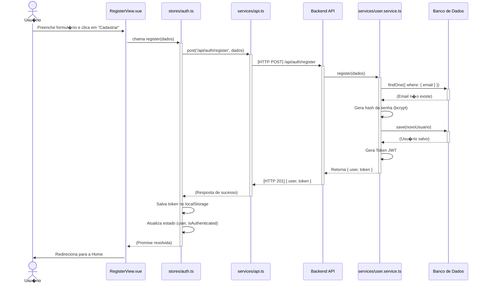
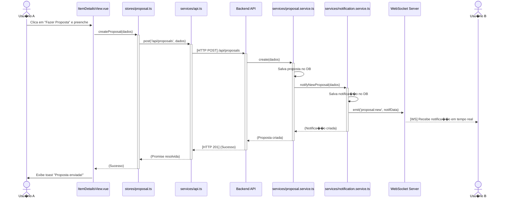
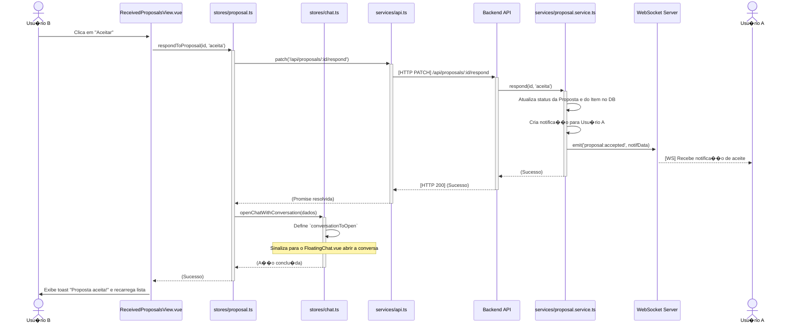
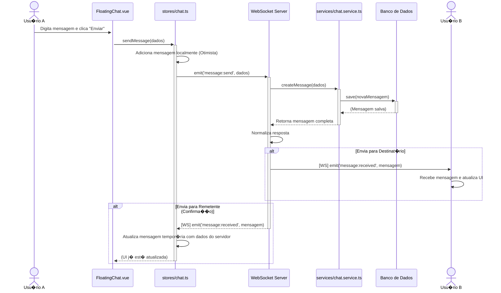
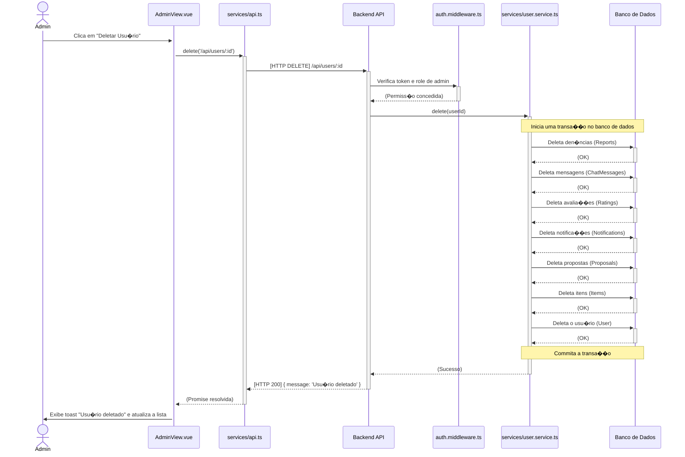

<!-- DOC-META: status=ativo; ultima_revisao=2026-04-10; proxima_revisao=trimestral -->
# ?? Diagramas de Sequ�ncia UML - TrocaAi

Este documento cont�m os diagramas de sequ�ncia UML para as principais funcionalidades do sistema, ilustrando a intera��o entre os componentes do frontend e backend.

---

## 1. Diagrama de Sequ�ncia: Cadastro de Novo Usu�rio

Este diagrama mostra o fluxo completo desde o momento em que um usu�rio preenche o formul�rio de registro at� a confirma��o de que sua conta foi criada e ele est� autenticado no sistema.

---

## 2. Diagrama de Sequ�ncia: Fazer e Aceitar uma Proposta

Este � um fluxo mais complexo que envolve dois usu�rios e a intera��o com o sistema de notifica��es e chat.

### Parte A: Usu�rio A faz uma proposta

### Parte B: Usu�rio B aceita a proposta

---

## 3. Diagrama de Sequ�ncia: Troca de Mensagens em Tempo Real (Chat)

Este diagrama detalha como a comunica��o via WebSocket funciona quando um usu�rio envia uma mensagem para outro.

---

## 4. Diagrama de Sequ�ncia: Fluxo Administrativo (Deletar Usu�rio)

Este diagrama mostra como um administrador pode deletar um usu�rio e como o backend lida com a exclus�o em cascata de todos os dados relacionados a esse usu�rio.

